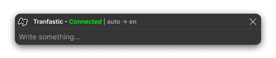

<p align="center">
  <a href="https://github.com/ysfemreAlbyrk/Tranfastic">
    
  </a>
</p>

<h1 align="center">Tranfastic</h1>

---

<h4 align="center">Anlık Çeviri Uygulaması (GUI ile)</h3>

<p align="center">
  <br>
  <a href="#-özellikler" style="color: #0366d6">Özellikler</a>
  .
  <a href="#-başlangıç" style="color: #0366d6">Başlangıç</a>
  .
  <a href="#%EF%B8%8F-yapılandırma" style="color: #0366d6">Yapılandırma</a>
  .
  <a href="#-katkıda-bulunma" style="color: #0366d6">Katkıda Bulunma</a>
  .
  <a href="#%EF%B8%8F-geliştirme-yol-haritası" style="color: #0366d6">Geliştirme</a>
  .
  <a href="#-lisans" style="color: #0366d6">Lisans</a>
  <br>
  <br>
</p>

<p align="center">
   <a href="https://www.python.org/downloads/">
      <image src="https://img.shields.io/badge/Python-3.8+-blue.svg" alt="Python 3.8+" />
   </a>
   <a href="https://www.microsoft.com/windows">
      <image src="https://img.shields.io/badge/Platform-Windows%20%7C%20Linux-blue.svg" alt="Windows | Linux" />
   </a>
   <a href="https://opensource.org/licenses/MIT">
      <image src="https://img.shields.io/badge/License-MIT-yellow.svg" alt="License: MIT" />
   </a>
</p>

<div align="center">



</div>

## ⚠️ Şu anda sadece **Windows** için mevcuttur. Linux ve Mac için yakında yayınlanacaktır.

## 📖 Hakkında

Tranfastic, çalışırken anlık, gerçek zamanlı çeviri için tasarlanmış hafif bir Python uygulamasıdır. Sistem tepsisinde sessizce çalışır ve hızlı bir kısayol tuşu metin girişi için bir pencere açar, çevrilen metni kopyalama veya ekleme için hazır hale getirir.

## ✨ Özellikler

- **🌐 Gerçek Zamanlı Çeviri:** Yazarken anında çeviri sağlar.
- **⚡ Kısayol Tuşu Aktivasyonu:** Özelleştirilebilir klavye kısayolu ile çeviri penceresini anında açar.
- **🖥️ Sistem Tepsisi Entegrasyonu:** Karmaşıklığı en aza indirmek için arka planda sessizce çalışır.
- **⚙️ Özelleştirilebilir Ayarlar:** Kaynak ve hedef dilleri yapılandırmanıza olanak tanır.
- **🔒 Gizlilik Odaklı:** Hiçbir çeviri geçmişi veya hassas bilgi saklamaz.
- **🎨 Temiz Arayüz:** Çalışmanızı rahatsız etmeyen minimalist tasarım.
- **🔧 Kolay Yapılandırma:** Dil tercihleri için basit ayarlar menüsü.

## 🚀 Başlangıç

### Kurulum

1. **Depoyu klonlayın:**
   ```bash
   git clone https://github.com/your-username/Tranfastic.git
   cd Tranfastic
   ```
2. **Bağımlılıkları yükleyin:**
   ```bash
   pip install -r requirements.txt
   ```

### Uygulamayı Çalıştırma

1. **Tranfastic'ı başlatın:**

   ```bash
   python main.py
   ```

   Tranfastic simgesi sistem tepsinizde görünecektir.

2. **Kısayol Tuşunu Kullanma:**
   - `Shift+Alt+D` (varsayılan) tuşlarına basın veya ayarlarda tercih ettiğiniz kısayolu belirleyin.
3. **Giriş ve Çeviri:**

   - Açılan pencereye metin yazın veya yapıştırın ve çevirinizi almak için Enter'a basın.

4. **Kolay Kapatma:**
   - Açılan pencereyi hızlıca kapatmak için `Esc` tuşuna basın.

## ⚙️ Yapılandırma

- **Dil Ayarları:** Ayarlar menüsünde tercih ettiğiniz kaynak ve hedef dilleri belirleyin.
- **Kısayol Özelleştirme:** İsteğinize uygun olarak kısayol tuşunu değiştirin.
- **Başlangıçta Çalıştırma (Windows):** İsteğe bağlı olarak Tranfastic'ın bilgisayarınız açıldığında başlamasını etkinleştirin.

## 🤝 Katkıda Bulunma

Katkılarınızı bekliyoruz! Katkıda bulunmak için:

1. **Depoyu fork edin** ve özelliğiniz veya hata düzeltmeniz için yeni bir dal oluşturun.
2. **Değişikliklerinizi test edin** kararlılığı sağlamak için.
3. **Bir pull request gönderin**, değişiklikleri ve eklenen özellikleri açıklayarak.

Hata raporları için lütfen şunlarla birlikte bir issue açın:

- Sorunun net bir açıklaması.
- Sorunu yeniden üretme adımları.
- Mümkünse `logs/[date].log` dosyasının içeriği (uygulamanın dizininde bulunur).

## 🛠️ Geliştirme Yol Haritası

**Mevcut özellikler ve gelecek güncellemeler fazara göre düzenlenmiştir:**

### ✅ Faz 1: Temel Altyapı (Tamamlandı)

- [x] Kısayol tuşu ve günlük kaydı uygulaması
- [x] Sistem tepsisi entegrasyonu (özel ikon ve menü)
- [x] Minimalist, modern, başlıksız çeviri penceresi
- [x] Dil ve kısayol ayarlarının özelleştirilebilmesi
- [x] Lokal çeviri geçmişi (günlük dosya, opsiyonel)
- [x] Koyu tema ve özel font entegrasyonu
- [x] Çevirinin odaklanılan inputa otomatik yapıştırılması
- [x] Ayarlar içinde Hakkında bölümü
- [ ] Windows başlangıcında çalıştırma seçeneği

### 🔄 Faz 2: Kullanıcı Deneyimi İyileştirmeleri (Devam Ediyor)

- [ ] İlk açılışta odak çalınmasını önleme
- [ ] Seçili alanlardan doğrudan metin yakalama
- [ ] Çeviriler için kullanıcı bildirimleri ekleme
- [ ] Tepsi menüsünde hızlı dil değiştirici
- [ ] Pencere boyutu ve şeffaflığının özelleştirilebilmesi
- [ ] Tüm arayüz için klavye ile gezinme
- [ ] Panodaki içeriği otomatik algılayıp çevirme
- [ ] **Çeviri Geçmişi Yönetimi:**
  - [ ] Çeviri geçmişini görüntüleme, arama ve yönetme için modern arayüz
  - [ ] Meta verilerle (zaman damgası, dil çiftleri, sıklık) veritabanı yapısı
  - [ ] Önemli çevirileri hızlı erişim için yıldızlama/favoriler
  - [ ] Metin, tarih veya dil çiftlerine göre arama ve filtreleme
  - [ ] Organizasyon için kategoriler ve etiketler
  - [ ] Toplu işlemler (silme, dışa aktarma, kategorilendirme)
  - [ ] Yedekleme ve senkronizasyon yetenekleri

### 🚀 Faz 3: Gelişmiş Özellikler

- [ ] Otomatik güncelleme sistemi (GitHub releases üzerinden)
- [ ] OCR ile görselden metin çevirisi
- [ ] Sesli giriş ve çeviri
- [ ] Çoklu API desteği (Google, DeepL, Yandex, vs.)
- [ ] Çeviri geçmişini dışa/içe aktarabilme
- [ ] Tema desteği (açık/koyu/özel)
- [ ] Uygulama içi geri bildirim ve hata bildirimi

### 🤖 Faz 4: Yapay Zeka ve Makine Öğrenmesi

- [ ] Offline çeviri (yerel ML modeli)
- [ ] Makine öğrenmesi ile çeviri iyileştirmeleri
- [ ] Ollama entegrasyonu ile yerel AI destekli çeviri
- [ ] Bağlam farkında çeviriler

### 🌍 Faz 5: Platform Genişletme

- [ ] Çoklu platform desteği (Linux, macOS)

**Senin de bir fikrin mi var? Issue veya pull request açabilirsin!**

## 🙏 Açık Kaynak Bağımlılıkları

Tranfastic, bu harika açık kaynak projeler olmadan mümkün olmazdı:

- **[googletrans](https://github.com/ssut/py-googletrans)** - Çeviri motorumuzu güçlendiren Google Translate API wrapper'ı
- **[PyQt5](https://www.riverbankcomputing.com/software/pyqt/)** - Modern, duyarlı arayüzümüz için çok platformlu GUI framework'ü
- **[pystray](https://github.com/moses-palmer/pystray)** - Tranfastic'ı arka planda sessizce çalıştıran sistem tepsisi entegrasyonu
- **[keyboard](https://github.com/boppreh/keyboard)** - Anlık çeviri penceresi aktivasyonu için global kısayol tuşu algılama
- **[Inter Font](https://github.com/rsms/inter)** - Temiz arayüzümüz için güzel, modern font ailesi
- **[Material Symbols](https://fonts.google.com/icons)** - UI öğeleri için Google'ın Material Design ikonları
- **[pywin32](https://github.com/mhammond/pywin32)** - Sorunsuz Windows entegrasyonu için Windows'a özel API'ler

## 📝 Lisans

Bu proje MIT Lisansı altında lisanslanmıştır. Detaylar için `LICENSE` dosyasına bakın.
