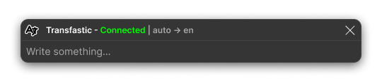

<p align="center">
  <a href="https://github.com/your-username/Tranfastic">
    
  </a>
</p>

<h1 align="center">Tranfastic</h1>

---

<h4 align="center">Instant Translator App with GUI</h3>

<p align="center">
  <br>
  <a href="#-features">Features</a>
  .
  <a href="#-getting-started">Getting Started</a>
  .
  <a href="#%EF%B8%8F-configuration">Configuration</a>
  .
  <a href="#-contributing">Contributing</a>
  .
  <a href="#%EF%B8%8F-development-roadmap">Development</a>
  .
  <a href="#-license">License</a>
  <br>
  <br>
</p>

<p align="center">
   <a href="https://www.python.org/downloads/">
      <image src="https://img.shields.io/badge/Python-3.8+-blue.svg" alt="Python 3.8+" />
   </a>
   <a href="https://www.microsoft.com/windows">
      <image src="https://img.shields.io/badge/Platform-Windows%20%7C%20Linux-blue.svg" alt="Windows | Linux" />
   </a>
   <a href="https://opensource.org/licenses/MIT">
      <image src="https://img.shields.io/badge/License-MIT-yellow.svg" alt="License: MIT" />
   </a>
</p>

<div align="center">



</div>

## ⚠️ Currently only available on **Windows**. It will be released for Linux and Mac.

## 📖 About

Tranfastic is a lightweight Python application designed for instant, real-time translation while you work. It sits discreetly in your system tray, and a quick hotkey opens a window for text input, making translated text readily available for copying or inserting.

## ✨ Features

- **🌐 Real-time Translation:** Provides on-the-fly translations as you type.
- **⚡ Hotkey Activation:** Opens translation window instantly with a customizable keyboard shortcut.
- **🖥️ System Tray Integration:** Operates silently in the background to minimize clutter.
- **⚙️ Customizable Settings:** Lets you configure source and destination languages.
- **🔒 Privacy Focused:** Does not store any translation history or sensitive information.
- **🎨 Clean Interface:** Minimalist design that doesn't distract from your work.
- **🔧 Easy Configuration:** Simple settings menu for language preferences.

## 🚀 Getting Started

### Installation

1. **Clone the repository:**
   ```bash
   git clone https://github.com/your-username/Tranfastic.git
   cd Tranfastic
   ```
2. **Install dependencies:**
   ```bash
   pip install -r requirements.txt
   ```

### Run the Application

1. **Start Tranfastic:**

   ```bash
   python main.py
   ```

   The Tranfastic icon will appear in your system tray.

2. **Using the Hotkey:**
   - Press `Shift+Alt+D` (default) or set your preferred hotkey in the settings.
3. **Input & Translate:**

   - Type or paste text into the pop-up window and press Enter to receive your translation.

4. **Close with Ease:**
   - Press `Esc` to quickly close the pop-up window.

## ⚙️ Configuration

- **Language Settings:** Set your preferred source and destination languages in the settings menu.
- **Shortcut Customization:** Modify the hotkey to suit your workflow.
- **Launch on Startup (Windows):** Optionally enable Tranfastic to start when your computer boots.

## 🤝 Contributing

We welcome contributions! To contribute:

1. **Fork the repository** and create a new branch for your feature or bug fix.
2. **Test your changes** to ensure stability.
3. **Submit a pull request**, explaining the changes and any added features.

For bug reports, please open an issue with:

- A clear description of the issue.
- Steps to reproduce the problem.
- The `logs/[date].log` file content (located in the application's directory) if available.

## 🛠️ Development Roadmap

**Current features and future updates:**

- [x] Hotkey and logging implementation
- [ ] Prevent focus-stealing on initial open
- [ ] Capture text directly from selected fields
- [ ] Add user notifications for translations
- [ ] Enable launch on Windows startup

## 📝 License

This project is licensed under the MIT License. See the `LICENSE` file for details.
